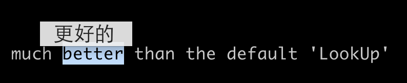

Moved to https://github.com/idning/ning-projects/tree/master/udict

About udict
===========

Yet Another dict for MAC, much better than the default 'LookUp'

- can be used in all apps
- better look

TODO
====

1. add status bar icon
2. better get-current-select method
    - not always trigger on double click
3. show in fullscreen apps
4. maybe we can use https://translate.google.com to get the main translate

